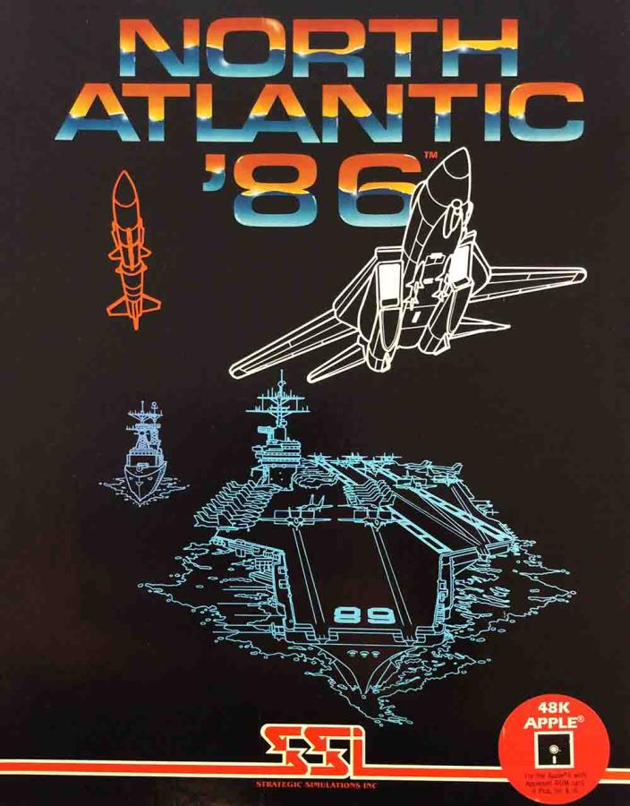

# North Atlantic 86

[North Atlantic '86](https://en.wikipedia.org/wiki/North_Atlantic_%2786), was released in 1983 by the great game creator, [Gary Grigsby](https://en.wikipedia.org/wiki/Gary_Grigsby). The game featured two player (NATO v USSR) or a human player (NATO) against a computer player (USSR). The two players battled for control of the North Atlantic in the year 1986. 

The goal of the NATO player: 

    (1) Keep the sea lanes open so adequate supplies would 
        reach the Allies in Great Britian 
    (2) Seek and destroy USSR naval elements in the North 
        Atlantic. 

The goal of the USSR player: 

    (1) Prevent supplies from reaching the British Isles, 
    (2) Eliminate the threat to its naval forces at Iceland
        and the Faroes so that it could operate uncontested
        in the North Atlantic
    (3) Maintain air superiority over the British Isles. 

Game play included landing paratroopers, shore bombardment from battleships, carrier battle groups and countless warnings of "Incoming Vampires!". It was great fun to play!

|     Doc      |            Description           |   Type   |
|--------------|:--------------------------------:|:--------:|
|[NA86 Manual](docs/north_atlantic_86_manual.txt)|Original Manual |`ASCII`|
|[NA86 Manual](docs/north_atlantic_86_manual.md)|Original Manual|`Markdown`|
|[NA86 Manual](https://archive.org/embed/north-atlantic-86_manual)|Original Manual|`PDF`|
|[NA86 Reference Card](docs/north_atlantic_86_reference_card.pdf)|Original Reference Card|`PDF`|
|[NA86 Box Cover](docs/images/box-front.png)|Original Box Cover|`PNG`|
|[Original Nimitz Image](docs/images/a-high-angle-bow-view-of-the-nuclear-powered-aircraft-carrier-uss-nimitz-cvn-8e99fd.jpg)[[1](#references)]|Original Nimitz Image|`JPG`|

")

### References
1. ["A high angle bow view of the nuclear-powered aircraft carrier USS NIMITZ (CVN 68) underway. (Substandard image)"](https://nara.getarchive.net/media/a-high-angle-bow-view-of-the-nuclear-powered-aircraft-carrier-uss-nimitz-cvn-8e99fd). U.S. National Archives, NARA & DVIDS Public Domain Archive (01 January 1980).